# LED Strip

[TOC]

## 1.Android Application

### 1.1 Install Apk

-  Download  [LinkspriteIo.apk](https://github.com/Sanqi5401/LinkspriteIO/raw/master/apk/linkspriteio_v1.0.2.apk) , And Install.

### 1.2 Register Or Login

- Enter to the login page

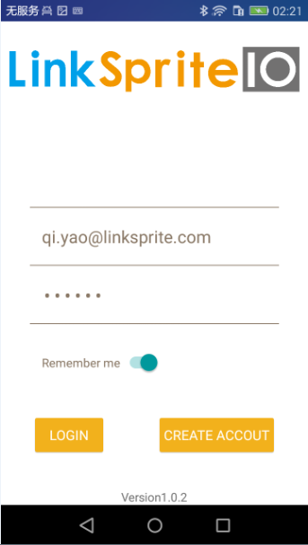

- If not register,Please register

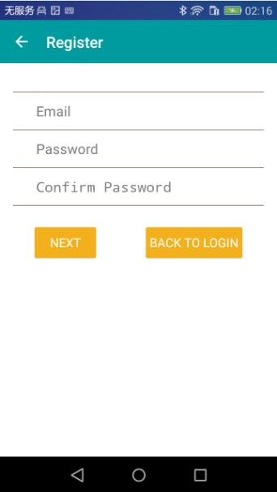

### 1.3 Create Device

- If not have device,Please click + icon to add device

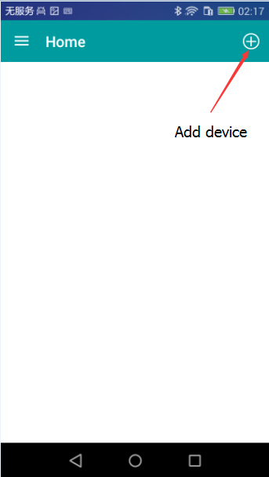

- Please choose LED button  and  other device type will be added later.

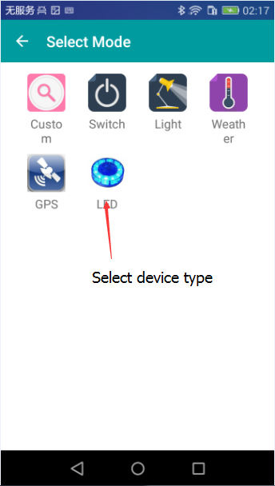

- Please choose ADD button to create a device

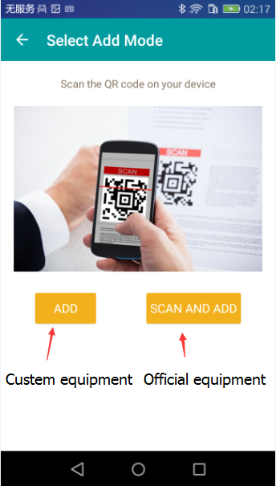

- 
  Fill in the name of the device and group name, and click the confirm button to create the device

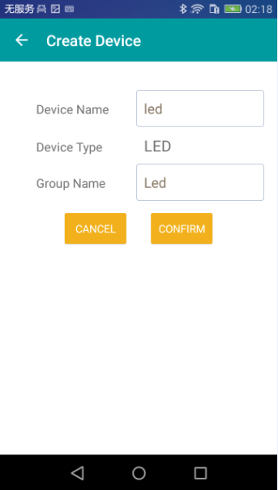

### 1.4 LED Strip Control

- Please choose the device button to set device

  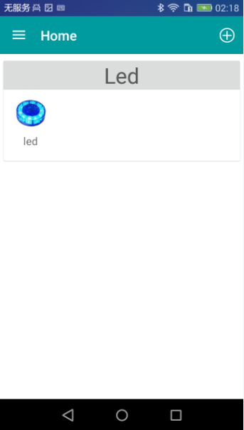

- LED strip how to show：

  > 1.Flowing water lights
  >
  > 2.Bln control
  >
  > 3.Blink
  >
  > 4.Custom
  >

  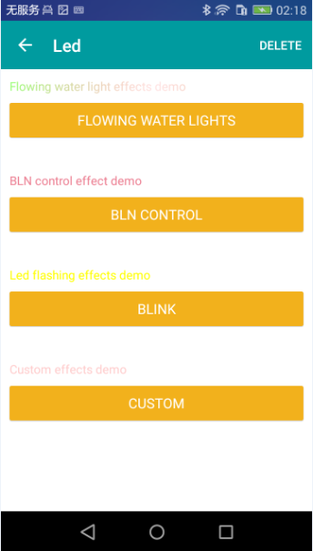

- Set the flowing water lights

  > Set the total number of LED strip:Total
  >

  > Set the time of flowing water lights:Time 
  >

  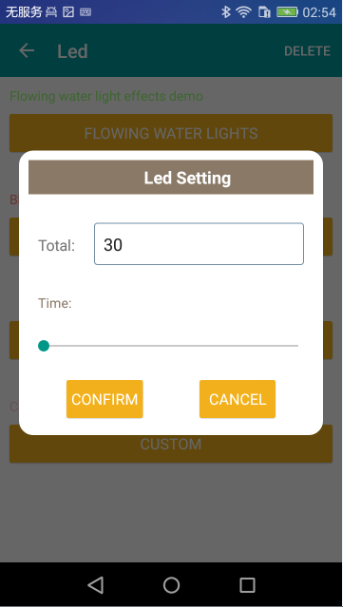

- Set bln control

  > Set the total number of LED strip:Total
  >

  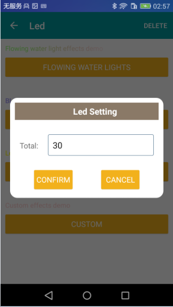

- Set blink

  > Set the total number of LED strip:Total
  >

  > Set the time of blink:Time
  >

  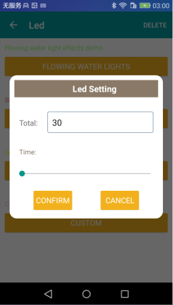

- Set custom

  > Set the total number of LED strip:Total
  >

  > Set the start number which :Start
  >

  > Set the end number:End
  >

  > Set the color of LED:Color (Four color：***Red,Blue,Green,White***)
  >

  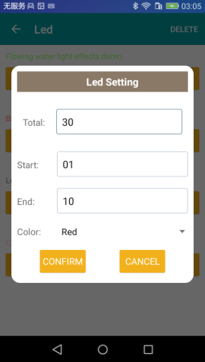
